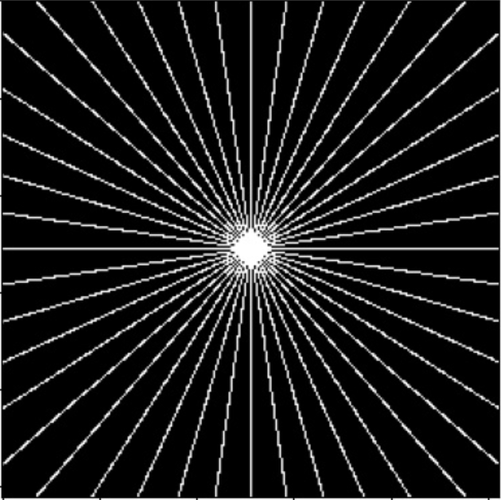
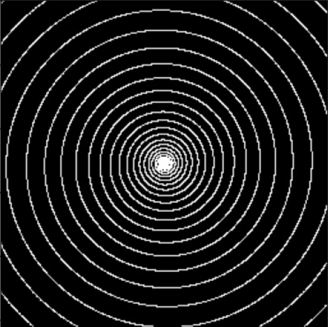
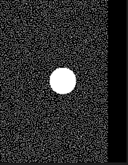

# MIV实验室MRI_complex_dataset数据处理
不要随意copy数据集，尤其是FastMRI数据集，很大，1T多


## 1.FastMRI：

### a.官网：

https://fastmri.med.nyu.edu/

### b.服务器地址：

处理数据(每个文件选中间5个slice)：v100：/home/data/ljh/fastmri/multi/dataset

原版数据：xxx.32服务器：/home/disk3/wx/fastMRI_mulit/dataset

### c.数据说明：

数据处理：v100:/home/data/ljh/fastmri/MRI/dataset/knee_multi.py

.h5文件 ；15个线圈；训练数据集：973个文件 验证数据集：197文件

```python
hfile = h5py.File(file_name, 'r')#<KeysViewHDF5 ['ismrmrd_header', 'kspace', 'reconstruction_rss']>
kspace_data = hfile['kspace'][()]#
print(kspace_data.shape)#(33, 15, 640, 372)
kspace_data = hfile['reconstruction_rss'][()]#
print(kspace_data.shape)#((33, 320, 320))
print(hfile.keys())
```

每个文件数据维度：(slice, coil, h, w)，slice数目10-50不等，线圈数目是15；kspace中心裁剪为320x320；

数据需要均值方差归一化，data_max在hfile['ismrmrd_header']，在计算PSNR和SSIM时作为data_range


### d.数据处理参考

https://github.com/zaccharieramzi/fastmri-reproducible-benchmark

https://github.com/facebookresearch/fastMRI


## 2.CC-359 12线圈数据集：

### a.官网：

https://sites.google.com/view/calgary-campinas-dataset/home

### b.服务器地址：

原版数据：v100:/home/data/ljh/fastmri/Brain_Multi

### c.数据说明：

数据处理文件：/home/data/ljh/fastmri/code/dataset/Brain_dataset.py

训练数据：47个文件  验证数据：20个文件， h5格式文件读取只有kspace数据：12个线圈

```python
hfile = h5py.File(file_name, 'r')
kspace_data = hfile['kspace'][()]
# (256, 218, 170, 24),256是slice个数，24是12个线圈的实部和虚部(通道0和1，通道2和3类推)
# 共有三种分辨率218x170；218x174；218x180
```

每个文件256个slice，分辨率共有三种；218x170；218x174；218x180；分辨率不一样的话batch size只能为1，可以统一中心裁剪为218x170来处理。

现有泊松采样mask权重位于：v100：/home/data/ljh/fastmri/code/dataset/poisson_sampling

### d.数据处理参考

https://github.com/rmsouza01/MC-MRI-Rec

## 3.下采样方式：

笛卡尔：


径向采样：(256x256)的mask：v100:/home/data/ljh/Brain_MRI/Brain_MRI/dataset/radial：使用mask时需要shift，即四周变中心，中心变四周，具体见v100：/home/data/ljh/Brain_MRI/Brain_MRI/dataset/Brain_single_dc_radial.py



螺线采样：（256x256）mask：v100:/home/data/ljh/Brain_MRI/Brain_MRI/dataset/spiral；**spiral_10指采样10%**；使用mask时需要shif



泊松采样: mask：v100:/home/data/ljh/fastmri/code/dataset/poisson_sampling




杂项：

#### 0.github上现有的model_zoo

1. https://github.com/wdika/mridc
2. https://github.com/NKI-AI/direct
3. https://github.com/zaccharieramzi/fastmri-reproducible-benchmark


#### 1.pytorch1.4和pytorch1.11区别

1. 后者有complex64数据类型，可以直接进行复数运算，矩阵的维度可以是(batch, coil, h,w)；而前者只能自己实现复数的乘法等操作,数据维度一般是(batch, coil, h, w, 2)
2. 傅里叶变换函数不一样
